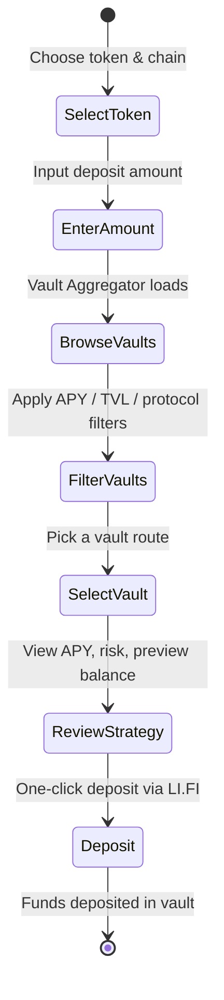

<div align="center">
  
  


# Mondo

**The Monad-first yield aggregator. One click from native MON to the best vault.**
**45+ Monad vaults across Euler, Neverland & Morpho — atomic wrap + deposit, single signature.**

[](https://monad.xyz)
[](https://li.fi)
[](https://monad.xyz)
[](./LICENSE)

</div>

---

## What is Mondo?

Yield farming is fragmented. Dozens of protocols, hundreds of vaults, scattered across chains. Finding the best opportunity means checking Aave, Morpho, Euler, Yo Protocol, and more — one by one.

**Mondo** is a yield route aggregator **built for Monad**, with cross-chain support to 15+ EVM networks. It aggregates every vault opportunity in real time via the **LI.FI Earn API**. Pick a token, pick a chain, and instantly see the best yield routes ranked by APY, TVL, and risk tier. One-click deposit handles the swap, bridge, and deposit in a single signed transaction through **LI.FI Composer** — including atomic native **MON → WMON vault** deposits.

Think: **DEX aggregator UX, applied to yield vaults — Monad-first.**

---

## Built for Monad

Mondo is **Monad-native by default**. The app boots into Monad as the preferred network and surfaces Monad's emerging yield ecosystem first.

| Monad-Native Capability | What It Does |
|--------------------------|--------------|
| **Default chain = Monad (143)** | Network picker, wallet connector, and portfolio filter all default to Monad |
| **Native MON deposits** | Deposit native MON straight into WMON vaults — atomic wrap + deposit, single signature |
| **MON ↔ WMON normalization** | Asset filter auto-maps MON → WMON when querying LI.FI Earn so vaults always surface |
| **Monad-tuned TVL floor** | Per-chain `minTvlUsd` is `0` for Monad (vs. $100k elsewhere) so early-stage vaults appear |
| **Real MON pricing** | Recomputes USD value from live `priceUSD` (LI.FI tokens) — no $1 stable-coin assumption |
| **Curated Monad assets** | WMON, shMON, sMON, gMON, USDC, WETH, cbBTC, USDT0, USD1 all pre-included |

**Monad protocols & vaults Mondo currently surfaces:**

| Protocol | Vault Type | Underlying | Approx. TVL |
|----------|------------|------------|-------------|
| **Euler V2** | Lending vault (eWMON-7, eUSDC, eWBTC) | WMON, USDC, WBTC, XAUt0 | $50K – $335K |
| **Neverland** | Liquid staking / yield | shMON, sMON, gMON, WETH, USDT0, earnAUSD, loAZND | $250K – $3.3M |
| **Morpho V1** | Curated lending | STEAKETH, BBQCBBTC, BBQUSDT0, BBQUSD1, HYPERCBBTCA | $1.5M – $50M |

Total: **45 Monad vaults discoverable** across **3 protocols** at the time of writing.

---

## Why Mondo Exists

### Who This Is For

Meet Dani. She's a yield farmer who's been rotating capital across DeFi for two years — supply USDC on Aave when rates spike, move to Morpho when Aave gets crowded, bridge to Base when a new Euler vault launches with boosted rewards, then pull everything back to stables before a governance vote shakes the TVL.

She's good at it. Her portfolio is up 19% this year, beating most passive strategies.

But Dani has a problem. Every time she wants to move, she has to manually check six protocol dashboards across four chains. She opens Aave on Arbitrum, Morpho on Ethereum, Euler on Base, compares APYs in a spreadsheet, checks TVLs on DefiLlama, evaluates risk by reading governance forums. Then she executes: approve token, swap if needed, bridge to the right chain, deposit into the vault. Four transactions, three gas payments, twenty minutes. By the time she's done, the rate she was chasing has already dropped because everyone else saw the same opportunity.

She tried yield aggregators, but they only show their own vaults. She tried DeFi dashboards, but they're read-only — she still has to go to each protocol to deposit. And none of them handle cross-chain deposits. If the best vault is on a different chain than where her funds sit, she's on her own with the bridge.

### What Dani Actually Needs

Dani doesn't need another dashboard. She needs a **yield route finder** — something that scans every vault across every protocol and chain, ranks them by APY, lets her filter by risk and TVL, and then handles the entire deposit in one click. Swap, bridge, deposit — a single signed transaction.

That's Mondo.

Mondo treats yield vaults the way DEX aggregators treat token swaps. You don't manually check Uniswap, SushiSwap, and Curve to find the best swap rate — the aggregator does it for you. Mondo does the same thing for yield: it aggregates 20+ protocols via the LI.FI Earn API, surfaces the best opportunities in real time, and executes the deposit through LI.FI Composer. One interface. One transaction. Best rate.

Dani opens Mondo, sees Monad pre-selected, types "10 MON" and instantly sees Euler, Neverland, and Morpho vaults ranked by APY. She filters for >5% APY, spots an Euler V2 WMON vault at 44.98% APY. She clicks it, reviews the strategy — APY, 30-day average, risk tier, timelock — then hits deposit. LI.FI Composer wraps her native MON, deposits into the Euler vault, and mints eWMON-7 shares — all in **one signed transaction**. Twenty minutes of manual work, compressed into ten seconds.

---

## Problem

| Problem | Description |
|---------|-------------|
| **Fragmented Yield** | Vault opportunities are scattered across 20+ protocols and multiple chains |
| **Manual Comparison** | No single interface to compare APY, TVL, risk, and deposit requirements side by side |
| **Multi-Step Deposits** | Depositing into a vault on another chain requires manual swap, bridge, then deposit |

## Solution

| Solution | How |
|----------|-----|
| **Live Aggregation** | Real-time vault discovery across Aave, Morpho, Euler, Yo Protocol, and more via LI.FI Earn |
| **Smart Filtering** | Filter by APY threshold, TVL minimum, risk tier, and protocol — find the right vault in seconds |
| **One-Click Deposit** | LI.FI Composer routes the optimal path: swap + bridge + deposit in a single transaction |

---

## Key Features

| Feature | Description |
|---------|-------------|
| Vault Aggregator | Live-ranked vault routes from 20+ DeFi protocols across multiple chains |
| APY / TVL / Protocol Filters | Dropdown filters with presets and custom input (e.g., >5% APY, >1M TVL) |
| Risk Tier Badges | Low / Medium / High risk classification based on APY and TVL heuristics |
| Strategy Review | Detailed vault breakdown with APY, TVL, 30d average, timelock, KYC status |
| Preview Balance | Projected balance at 1Y / 1M / 1W / 1D based on selected vault APY |
| One-Click Deposit | Swap + bridge + deposit routed through LI.FI Composer |
| Cross-Chain Support | Deposit from any chain — LI.FI handles the bridging automatically |
| Portfolio Tracker | View all active earn positions with live USD values across all networks |
| Withdraw Flow | One-click withdrawal routed back through LI.FI Composer |
| Share Card | Download or flex your earn positions on X with a generated visual card |
| Dynamic OG Image | Share links auto-generate preview cards for X / social embeds |
| All-Chain Wallet | 686 chains supported via wagmi — switch and transact on any network |

---

## Supported Chains

Monad is the **default and primary** network. All other chains are supported for cross-chain deposits via LI.FI bridge.

| # | Chain | Chain ID | Role | Status |
|---|-------|----------|------|--------|
| 1 | **Monad** | **143** | **Primary (default)** | Live |
| 2 | Base | 8453 | Cross-chain | Live |
| 3 | Ethereum | 1 | Cross-chain | Live |
| 4 | Arbitrum | 42161 | Cross-chain | Live |
| 5 | Polygon | 137 | Cross-chain | Live |
| 6 | Katana | 747474 | Cross-chain | Live |
| 7 | BSC | 56 | Cross-chain | Live |
| 8 | Optimism | 10 | Cross-chain | Live |
| 9 | Avalanche | 43114 | Cross-chain | Live |
| 10 | Linea | 59144 | Cross-chain | Live |
| 11 | Gnosis | 100 | Cross-chain | Live |
| 12 | Unichain | 130 | Cross-chain | Live |
| 13 | Mantle | 5000 | Cross-chain | Live |
| 14 | Sonic | 146 | Cross-chain | Live |
| 15 | Celo | 42220 | Cross-chain | Live |

---

## System Architecture

```
User selects token + chain + amount
       |
       v
  LI.FI Earn API
  Fetches ranked vault opportunities
       |
       v
  Vault Aggregator UI
  Filter by APY, TVL, risk, protocol
       |
       v
  User selects vault → Strategy Review
  APY, TVL, risk tier, preview balance
       |
       v
  LI.FI Composer (Quote API)
  Calculates optimal route: swap + bridge + deposit
       |
       v
  One-click deposit
  Single signed transaction via wallet
```

---

## User Flow



| Phase | Action | Actor |
|-------|--------|-------|
| Discover | Select token, chain, amount | User |
| Compare | Browse and filter vault routes | User |
| Review | Inspect APY, TVL, risk, projected yield | User |
| Deposit | One-click swap + bridge + deposit | LI.FI Composer |
| Track | Monitor positions in Portfolio | User |
| Withdraw | One-click exit via LI.FI | User |

---

## LI.FI Earn Integration

Mondo is built entirely on the **LI.FI Earn** and **LI.FI Composer** APIs. Here are the core integration points:

| Component | File | Description |
|-----------|------|-------------|
| **Vault Discovery** | [`lib/lifi-earn.ts`](./frontend/src/lib/lifi-earn.ts) | Fetches vault opportunities from LI.FI Earn API with chain, asset, and TVL filters |
| **Monad Asset Mapping** | [`stores/expert-store.ts`](./frontend/src/stores/expert-store.ts) | Auto-maps native MON → WMON when querying vaults; per-chain `minTvlUsd` (0 for Monad) |
| **MON Price Recompute** | [`lib/portfolio-fetcher.ts`](./frontend/src/lib/portfolio-fetcher.ts) | Replaces LI.FI's stale balanceUsd with live `priceUSD × balanceNative` for accurate Monad token valuations |
| **Deposit Quotes** | [`lib/lifi-quote.ts`](./frontend/src/lib/lifi-quote.ts) | Gets deposit/withdraw quotes from LI.FI Composer — calculates optimal route |
| **Vaults Proxy** | [`api/earn/vaults/route.ts`](./frontend/src/app/api/earn/vaults/route.ts) | Server-side proxy to LI.FI Earn API with API key injection |
| **Quote Proxy** | [`api/earn/quote/route.ts`](./frontend/src/app/api/earn/quote/route.ts) | Server-side proxy to LI.FI Quote API |
| **Portfolio Proxy** | [`api/earn/portfolio/[address]/route.ts`](./frontend/src/app/api/earn/portfolio/%5Baddress%5D/route.ts) | Fetches user's active earn positions from LI.FI |
| **Protocol Registry** | [`lib/protocol-registry.ts`](./frontend/src/lib/protocol-registry.ts) | Maps protocol slugs to display names and local logo paths |
| **Chain Metadata** | [`lib/lifi-meta.ts`](./frontend/src/lib/lifi-meta.ts) | Fetches chain and token metadata from LI.FI for logos and names |
| **Deposit Flow** | [`earn/deposit-sheet/`](./frontend/src/components/pages/(app)/earn/deposit-sheet/) | Full deposit UI — quote preview, cross-chain detection, tx execution |
| **Withdraw Flow** | [`portfolio/withdraw-sheet/`](./frontend/src/components/pages/(app)/portfolio/withdraw-sheet/) | Full withdraw UI — percentage selector, quote, tx execution |

---

## Tech Stack

| Layer | Technology |
|-------|-----------|
| Framework | Next.js 16 (App Router, Turbopack) |
| Language | TypeScript |
| Styling | Tailwind CSS 4 |
| Animations | Motion (framer-motion) |
| Web3 | wagmi v2, viem, RainbowKit |
| State | Zustand |
| Yield Data | LI.FI Earn API |
| Routing | LI.FI Composer (Quote API) |
| Icons | react-icons (Feather, Heroicons, Font Awesome) |
| Image Export | html-to-image |

---

## Getting Started

### Prerequisites

- Node.js 20+
- pnpm

### Setup

```bash
cd frontend
cp .env.example .env.local
# Fill in:
#   LIFI_API_KEY — from li.fi
#   PROJECT_ID — WalletConnect project ID
#   NEXT_PUBLIC_APP_URL — your domain (http://localhost:3000 for local)
pnpm install
pnpm dev
```

Open [http://localhost:3000/earn](http://localhost:3000/earn) to start discovering yield routes.


---

## Resources

### Monad
- [Monad](https://monad.xyz)
- [Monad Docs](https://docs.monad.xyz)
- [Monad Explorer](https://monadexplorer.com)
- Monad Protocols surfaced by Mondo: [Euler](https://app.euler.finance), [Neverland](https://neverland.fi), [Morpho](https://app.morpho.org)

### LI.FI
- [LI.FI Earn Documentation](https://docs.li.fi/earn/overview)
- [LI.FI Composer (Quote API)](https://docs.li.fi/li.fi-api/li.fi-api)
- [LI.FI API Reference](https://apidocs.li.fi)

